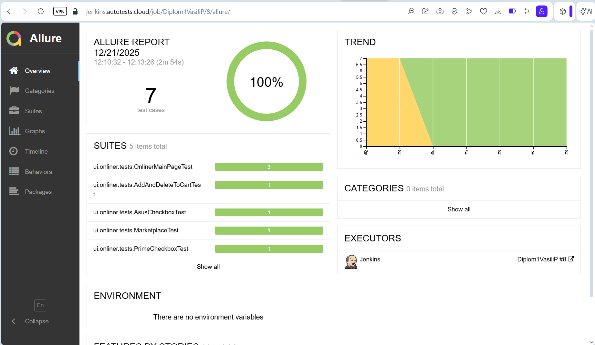
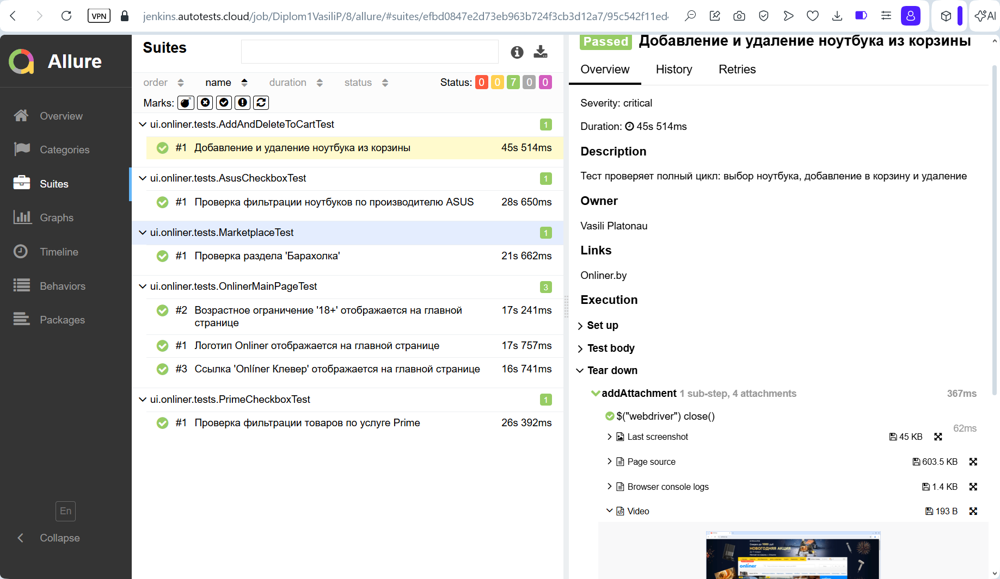
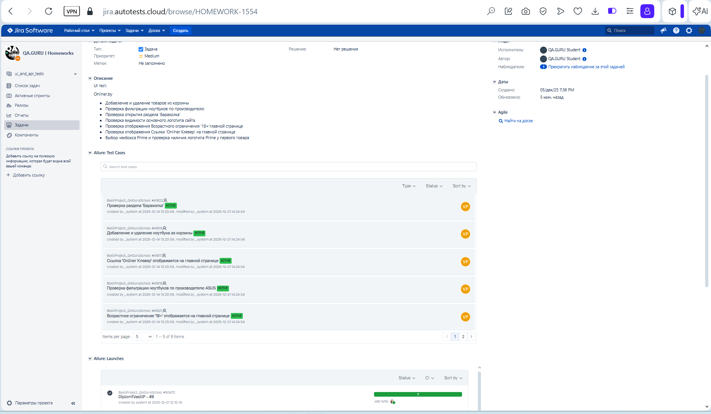
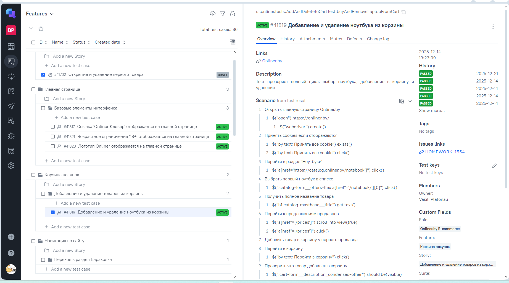
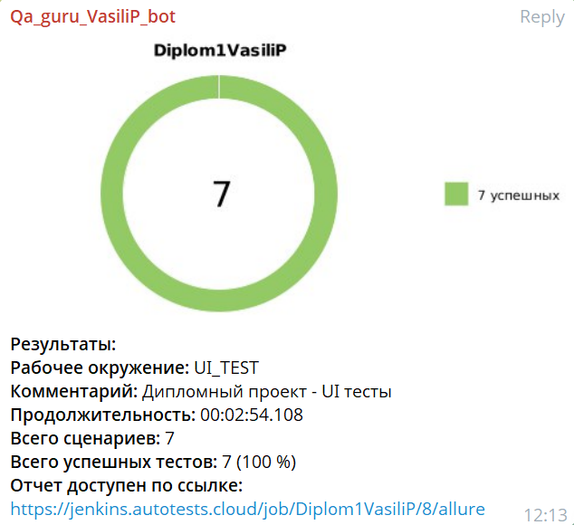


# Школа QA_GURU. Поток 37. Дипломный проект. 
# Данный проект состоит из трех частей:
# 1. <a href="#part1-3"> UI-тест </a> [](https://www.onliner.by/)

> Onliner.by — это крупнейший белорусский интернет-порта́л и онлайн-магазин
# 2. <a href="https://github.com/Vasili6666/Diplom2"> API-тест </a>[](https://jsonplaceholder.typicode.com/) 

> JSONPlaceholder — это фейковое REST API для тестирования и прототипирования.
# 3. <a href="https://github.com/Vasili6666/Diplom3"> Mobile-тест</a> [](https://play.google.com/store/apps/details?id=randomappsinc.com.sqlpracticeplus&hl=ru)

> SQL Practice PRO — Мобильное приложение. Практические упражнения на языке SQL.

----
# В проекте применены следующие технологии и инструменты

<p align="center">  
<a href="https://github.com/allure-framework/allure2"> </a>
<a href="https://qameta.io/"></a>
<a href="https://developer.android.com/"></a>
<a href="https://appium.io/docs/en/latest/"></a> 
<a href="https://gradle.org/"></a>
<a href="https://www.jetbrains.com/idea/"></a>  
<a href="https://www.java.com/"></a>  
<a href="https://www.jenkins.io/"></a>  
<a href="https://www.atlassian.com/ru/software/jira/"></a> 
<a href="https://junit.org/junit5/"></a>  
<a href="https://projectlombok.org/"></a>  
<a href="https://rest-assured.io/"></a>  
<a href="https://selenide.org/"></a>  
<a href="https://github.com/"></a>  
<a href="https://aerokube.com/selenoid/"></a> 
<a href="https://telegram.org"></a> 
</p>

____
<a id="part1-3"></a>
# Часть 1/3
#  UI-тест [](https://www.onliner.by/)


## **Содержание:**
____


* <a href="#cases">Примеры автоматизированных тест-кейсов</a>

* <a href="#jenkins">Сборка в Jenkins</a>

* <a href="#console">Запуск из терминала</a>

* <a href="#allure">Allure отчет</a>

* <a href="#jira">Интеграция с Jira</a>

* <a href="#testops">Интеграция с Allure TestOps</a>

* <a href="#telegram">Уведомление в Telegram при помощи бота</a>

* <a href="#video">Примеры видео выполнения тестов на Selenoid</a>

____
<a id="cases"></a>
## <a name="Примеры автоматизированных тест-кейсов">**Примеры автоматизированных тест-кейсов:**</a>
____

   - *Добавление и удаление товаров из корзины*
   - *Проверка фильтрации ноутбуков по производителю*
   - *Проверка открытия раздела 'Барахолка'*
   - *Проверка видимости основного логотипа сайта*
   - *Проверка отображения Возрастного ограничения '18+'главной странице*
   - *Проверка отображения Ссылки 'Onlíner Клевер' на главной странице*
   - *Выбор чекбокса Prime и проверка наличия логотипа Prime у первого товара*


____
<a id="jenkins"></a>
## </a><a name="Сборка"></a>Сборка в [Jenkins](https://jenkins.autotests.cloud/job/Diplom1VasiliP/)</a>
____


### **Параметры сборки в Jenkins:**

- *TASK*
- - *test* - Все тесты
- - *smoke_test* - Тесты с тэгом "Smoke"

- *BROWSER (браузер, по умолчанию chrome)*
- *BROWSER_VERSION (Версия браузера)*
- *BROWSER_SIZE (размер окна браузера, по умолчанию 1920x1080)*
- *UI_BASE_URL (Сайт для UI-теста)*
- *TELEGRAM_TOKEN (Токен Телеграм-бота)*
- *SELENOID_USER, SELENOID_PASS (логин, пароль для удаленного сервера Selenoid)*

<a id="console"></a>
## Команды для запуска из терминала
___
***Локальный запуск:***
- Все тесты
```bash  
gradle clean test
```
- Smoke-тестs
```bash  
gradle clean smoke_test
```

___
<a id="allure"></a>
## </a> <a name="Allure"></a>[Allure](https://jenkins.autotests.cloud/job/Diplom1VasiliP/8/allure/) отчет</a>
___

### *UI-тест*

<p align="center">  
 
 
</p>  


----
<a id="jira"></a>
## </a> <a name="Jira"></a>Интеграция с [Jira](https://jira.autotests.cloud/browse/HOMEWORK-1554)</a>
<p align="center">  
 
</p>

----
<a id="testops"></a>
## </a> <a name="TestOps"></a>Интеграция с [TestOps](https://allure.autotests.cloud/launch/50472/tree?search=W3siaWQiOiJzdGF0dXMiLCJ0eXBlIjoidGVzdFN0YXR1c0FycmF5IiwidmFsdWUiOlsicGFzc2VkIl19XQ%3D%3D&treeId=9649)</a>
<p align="center">  
 
</p>  

----
<a id="telegram"></a>
## </a> Уведомление в Telegram при помощи бота
____
<p align="center">  
  
</p>


____
<a id="video"></a>
## </a> Примеры видео выполнения тестов на Selenoid
____
<p align="center">
   
</p>

